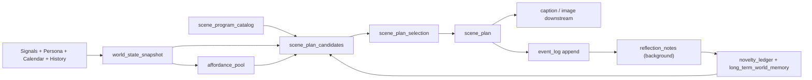

# IG Roleplay V2 ?????????????

???2026-03-19

## 1. ????

?? `ig_roleplay_v2` ?????? + ???????????????
- ????????? prompt
- ???????
- ????????
- ??? scene draft

????? 10 ??20 ??????????????????????????????????????????????life_record?

????????????????????????
- ??????????????????????
- ???????????????????? prompt ????
- ?????? + ???? + ???? + ??/??????
- ?????????????????????
- ?? typed runtime state??????????? hashtag/opening ??

?????????????????? scene list???????????

**????? -> ???? -> ????? -> ????? -> ????????? -> ?? scene plan**

## 2. ??????

### 2.1 ?????????

1. `F:\openclaw-dev\workspace\projects\ig_roleplay_v2\config
untime.config.json`
- `life_record.sceneFocus` ????????`weather_detail`?`city_corner`?`daily_object`?`small_surprise`
- ?????????????

2. `F:\openclaw-dev\workspace\projects\ig_roleplay_v2\scriptsuild_continuity_snapshot.js`
- ????????lane??? opening?hashtag
- ?? scene family?action family?object family?emotion landing?weather role ?????

3. `F:\openclaw-dev\workspace\projects\ig_roleplay_v2\scriptsuild_scene_plan_draft.js`
- ????????? draft
- `sceneFacts` ??? lane?weatherSignal?trendSignal?sensoryFocus ??
- ?????????????????

4. `F:\openclaw-dev\workspace\projects\ig_roleplay_v2\scriptsuild_scene_plan.js`
- `weatherSignal` / `trendSignal` ?????????
- `life_record` ????????? + ?? cue ??
- scene selection ?????? + rerank???????? + ?????

5. `F:\openclaw-dev\workspace\projects\ig_roleplay_v2\scripts\lib\scene_design.js`
- `collectConcreteSceneCues` ??????????? cue
- ?????????????????

### 2.2 ??????????

?????? LLM ????????????????
- ??????????
- ?????????
- ?????????
- ?? scene candidate pool
- ????? novelty ledger

??????????????????????????????????????

## 3. ??????

### 3.1 Convai??????? prompt?????? + ?? + ?? + ?? + ????

???
- [Convai Character Customization](https://docs.convai.com/api-docs/convai-playground/character-customization)
- [Convai Narrative Design](https://docs.convai.com/api-docs/convai-playground/character-customization/narrative-design)
- [Convai State Of Mind](https://docs.convai.com/api-docs/convai-playground/character-customization/state-of-mind)
- [Convai Memory](https://docs.convai.com/api-docs/convai-playground/character-customization/memory)
- [Convai Knowledge Bank](https://docs.convai.com/api-docs/convai-playground/character-customization/knowledge-bank)

????
- Convai ??????? Character Description?Knowledge Bank?Personality Traits?Core AI Settings?State of Mind?Memory?Narrative Design?External API ????
- Narrative Design ????????????? + ??? + ??? + graph editor??
- State of Mind ???????????????
- Memory ??? session ?????
- Knowledge Bank ????????????????????? prompt?

????????
- ????????????? weather/trend ???
- ??????????????????????/??/?????????????
- ?????????????? graph/program ???

### 3.2 Inworld??????? typed runtime data?????? prompt

???
- [Inworld Character Component](https://docs.inworld.ai/docs/unreal-engine/runtime/character-reference/InworldCharacterComponent/InworldCharacterComponent)
- [Inworld Simple Character Component](https://docs.inworld.ai/docs/unreal-engine/runtime/character-reference/InworldSimpleCharacterComponent/InworldSimpleCharacterComponent)
- [Inworld Character Subsystem](https://docs.inworld.ai/docs/unreal-engine/runtime/character-reference/InworldCharacterSubsystem/InworldCharacterSubsystem)
- [Inworld Memory Retrieve](https://docs.inworld.ai/docs/unreal-engine/runtime/v0.7/runtime-reference/InworldNode/InworldNode_MemoryRetrieve)

????
- Inworld ??? runtime data ?? character profile?voice settings?event history?conversation state?
- ??????????? emotion state?relationship state?knowledge filtering?goal management?trigger support?
- Memory retrieval ???? event history?current memory state?player input ???????
- Character Subsystem ? world subsystem ???????????????conversation target map?

????????
- ???????????? typed artifacts?????? prompt ??????????
- ?????????????????????? 5 ? caption ?????
- ?????????/??/???????? world-state registry???????????

### 3.3 Dialogflow CX????????? flow/page/route/parameter????????

???
- [Dialogflow CX Flows](https://cloud.google.com/dialogflow/cx/docs/concept/flow)
- [Dialogflow CX Pages](https://cloud.google.com/dialogflow/cx/docs/concept/page)

????
- Flow ??? Pages?Routes?Event Handlers?
- Page ??? Entry Fulfillment?Parameters?Routes?Route Groups?Event Handlers?
- ???????????????????? + ?????????????????????

????????
- `scene family` ??????????
- ??????`scene program` ?? `entry conditions / slots / transitions / output affordances`?
- ????????????????????????????????

### 3.4 LangGraph?????????????????????

???
- [LangGraph Memory Overview](https://docs.langchain.com/oss/javascript/langgraph/memory)

????
- ????? thread-scoped??? agent state?? checkpointer ????
- ????? namespace-scoped???? thread ???
- state ??????????????????????????

????????
- ???????????????????????????????
- ?? `runtime/current/*.json` ?? thread state?
- ????????? world memory namespace??? recurring objects?familiar places?unresolved micro-arcs?

### 3.5 Generative Agents???????? observation + planning + reflection????????

???
- [Generative Agents](https://research.google/pubs/generative-agents-interactive-simulacra-of-human-behavior/)

????
- ????????????????????????????????????????
- ?????? observation?planning?reflection ???????????

????????
- ???????? + scene draft????
- ?????? background reflection ?????????????????????????????????

## 4. ????????

?????????? scene family?????

1. ? **typed state** ????? prompt
2. ? **graph / program / flow** ????????
3. ? **retrieval + candidate reranking** ??????
4. ? **short-term + long-term memory** ???????????
5. ? **triggers / parameters / event handlers** ??????
6. ? **state-aware evaluation** ????????????????

## 5. ?????????

### 5.1 ?????

### 5.2 ????

?? `scene family` ???????????? **Scene Program**?
- ??????????
- ? entry conditions
- ? slot definitions
- ? weather role policy
- ? location archetype
- ? action kernel
- ? object slots
- ? emotional landing family
- ? image affordance
- ? caption affordance
- ? novelty cooldown rules

??????????????? / ?? / ????????
?????
- ??????????
- ??????????
- ??????????
- ?????????????
- ????????

## 6. ???????

### 6.1 `world_state_snapshot.json`

???????????????????? prompt?

?????
- `timeContext`
  - `date`
  - `daypart`
  - `weekdayMode`
  - `seasonPhase`
  - `schoolCalendarMode`
- `environment`
  - `weather`
  - `temperatureBand`
  - `weatherRoleCandidate`
  - `locationCity`
  - `mobilityWindow`
- `characterState`
  - `energy`
  - `socialBandwidth`
  - `attentionShape`
  - `budgetLevel`
  - `needState`
- `worldMemoryRefs`
  - `recurringObjects`
  - `familiarPlaces`
  - `microArcSeeds`
- `continuityPressure`
  - `lanePressure`
  - `sceneFatigue`
  - `objectFatigue`
  - `emotionFatigue`

?????
- ?? typed state???????????
- LLM ??????????? + ?????????? prompt ???

### 6.2 `affordance_pool.json`

??????????????????????????????????

???
- `indoor_reset_window`
- `short_errand_window`
- `transit_fragment_window`
- `shelter_from_rain_window`
- `rediscovery_window`
- `small_purchase_window`
- `return_or_repair_window`

???????????????????????????

### 6.3 `scene_program_catalog.json`

?????????????????????????????

?? `sceneProgram` ?????
- `id`
- `laneEligibility`
- `entryConditions`
- `requiredAffordances`
- `forbiddenConditions`
- `actionKernel`
- `locationArchetypes`
- `objectSlots`
- `weatherPolicy`
- `socialConfiguration`
- `emotionalLandingFamilies`
- `presencePolicies`
- `captionHooks`
- `imageHooks`
- `cooldownRules`

?????
- `rediscovery_program`
  - action kernel: `find / recover / unfold / notice again`
  - object slot: from `owned_small_objects` or `paper_fragments`
  - weather role: optional modifier only
  - emotional landing: `memory_return` or `quiet_completion`

- `threshold_pause_program`
  - action kernel: `pause / wait / look / hold`
  - location archetype: `stairwell / corridor / station edge / store doorway`
  - weather role: can be primary only if severe, otherwise secondary
  - emotional landing: `suspended_breath` or `tiny_reset`

Scene Program ?????
- ????????
- ????????????????

### 6.4 `scene_plan_candidates.json`

?????????? 3 ? 5 ? scene candidates??? 1 ??

?? candidate ?????
- `sceneProgramId`
- `filledSlots`
- `locationArchetype`
- `weatherRole`
- `objectBindings`
- `actionSequence`
- `emotionalLanding`
- `presenceMode`
- `captionHooks`
- `imageHooks`
- `noveltyScore`
- `feasibilityScore`
- `personaFitScore`
- `reasoningSummary`

### 6.5 `novelty_ledger.json`

????????????????????????? hashtag/opening?

?????
- `recentScenePrograms`
- `recentLocationArchetypes`
- `recentActionKernels`
- `recentObjectFamilies`
- `recentWeatherRoles`
- `recentEmotionalLandings`
- `recentCameraPolicies`
- `recentCaptionEndings`

??????
- exact overlap
- semantic similarity
- cooldown decay
- dominant-cluster penalty

## 7. ??????????????

????????

### ?????????
- `sceneFamily = ['desk', 'bookstore', 'stairs', 'bus', 'kitchen']`
- ?????? rigid list ??

### ??????????
?? scene ???????
- `actionKernel`
- `locationArchetype`
- `objectFamily`
- `weatherRole`
- `socialConfiguration`
- `emotionalLanding`
- `presencePolicy`

??? `rediscovery_program` ???????
- ???????
- ?????????
- ??????????
- ????????????
- ??????????????

??????????????????????
- ????
- ????
- ????
- ?????

## 8. ????????????

### 8.1 ?? `life_record.sceneFocus`

???
- `sceneFocus` ??????

???
- ?? `sceneFocus` ???????
- ???
  - `world_state_rules.json`
  - `scene_program_catalog.json`
  - `novelty_policy.json`

### 8.2 ?????????

?????
- `build_world_state_snapshot.js`

???
- signals
- identity profile
- continuity snapshot
- long-term world memory

???
- `world_state_snapshot.json`

### 8.3 ????????

?????
- `build_affordance_pool.js`

???
- ????????????????????

### 8.4 ? `scene_plan_draft` ?? candidate planner

??????
- `build_scene_plan_candidates.js`
- `select_scene_plan_candidate.js`

skill ?????
- LLM ?????? scene plan
- LLM ???? candidate summaries / slot suggestions / microplot polish
- ???????????????

### 8.5 ??????? motif ledger

? `build_continuity_snapshot.js` ?????????????
- lane
- openings
- hashtags

???????
- scene program
- location archetype
- action kernel
- object family
- emotional landing
- weather role

### 8.6 ?????scene notes?????scene semantics?

`image_brief` ? `image_request` ??????
- location archetype
- weather role
- object bindings
- presence policy
- camera policy

??????????? `sceneNotes`?

## 9. ?????????

?????
- `F:\openclaw-dev\workspace\projects\ig_roleplay_v2\config\scene_program_catalog.json`
- `F:\openclaw-dev\workspace\projects\ig_roleplay_v2\config\world_state_rules.json`
- `F:\openclaw-dev\workspace\projects\ig_roleplay_v2\config
ovelty_policy.json`
- `F:\openclaw-dev\workspace\projects\ig_roleplay_v2
untime\current\world_state_snapshot.json`
- `F:\openclaw-dev\workspace\projects\ig_roleplay_v2
untime\currentffordance_pool.json`
- `F:\openclaw-dev\workspace\projects\ig_roleplay_v2
untime\current\scene_plan_candidates.json`
- `F:\openclaw-dev\workspace\projects\ig_roleplay_v2
untime\current
ovelty_ledger.json`
- `F:\openclaw-dev\workspace\projects\ig_roleplay_v2
untime\current
eflection_notes.json`

???????
- `build_world_state_snapshot.js`
- `build_affordance_pool.js`
- `build_scene_plan_candidates.js`
- `select_scene_plan_candidate.js`
- `build_novelty_ledger.js`
- `build_reflection_notes.js`

## 10. ????

??????????? 10 ????????????????

- `sceneProgramEntropy`
- `locationArchetypeEntropy`
- `actionKernelEntropy`
- `emotionalLandingEntropy`
- `weatherAsPrimaryDriverRatio`
- `indoorDominanceRatio`
- `studyAftermathDominanceRatio`
- `topClusterShare`
- `medianPairwiseSemanticSimilarity`

??????
- 50 ? pre-image
- 100 ? pre-image
- 1 ? full simulate

## 11. ????

????????????????? scene family??

?????
- ????
- ????
- ????
- ????
- ?????

??????????????

??????????????????? 10 ??20 ?????????????????????????????
